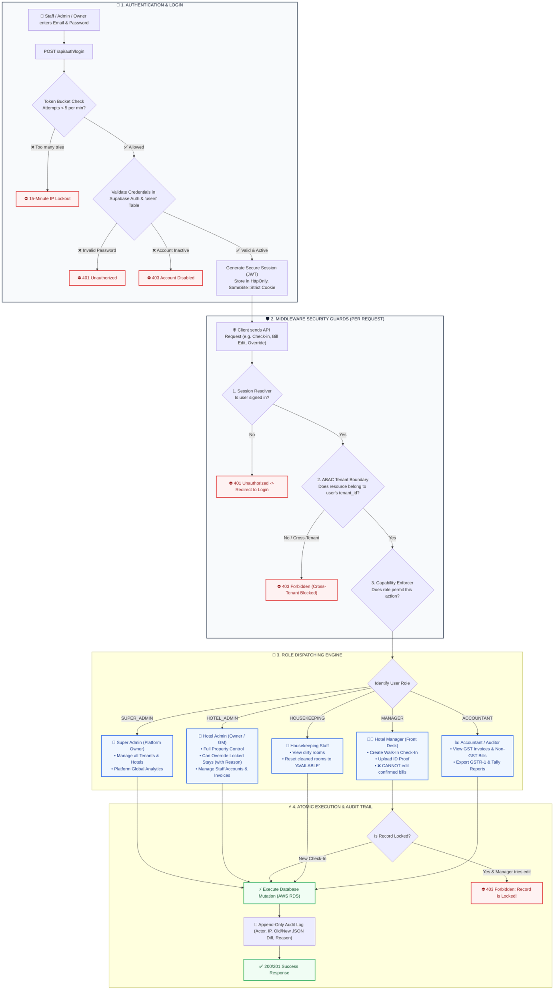
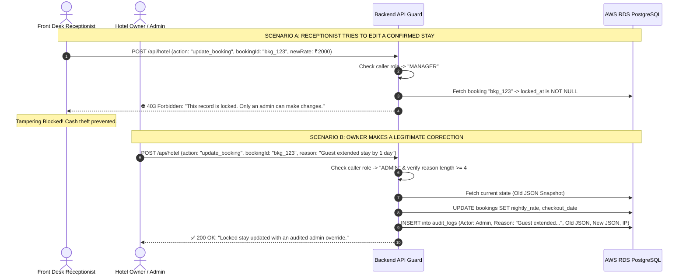

# HotelOS Management SaaS — Access Management & RBAC Flowchart Specification

> **Document Type**: Access Control Architecture, Role Hierarchy & Security Matrix  
> **Status**: Final Production Specification  
> **Scope**: Authentication, Authorization, RBAC Matrix, ABAC Tenant Isolation, and Anti-Fraud Record Locking  

---

## Table of Contents
1. [Master Access Management Flowchart](#1-master-access-management-flowchart)
2. [5-Tier Role Hierarchy & Staff Personas](#2-5-tier-role-hierarchy--staff-personas)
3. [Complete Role-Based Access Control (RBAC) Matrix](#3-complete-role-based-access-control-rbac-matrix)
4. [Anti-Fraud Record Locking & Admin Override Flow](#4-anti-fraud-record-locking--admin-override-flow)
5. [Attribute-Based Access Control (ABAC) Multi-Tenant Isolation](#5-attribute-based-access-control-abac-multi-tenant-isolation)
6. [Session Lifecycle & Security Enforcement](#6-session-lifecycle--security-enforcement)

---

## 1. Master Access Management Flowchart



---

## 2. 5-Tier Role Hierarchy & Staff Personas

```
                            ┌────────────────────────────────────────────────────────┐
                            │                    1. SUPER ADMIN                      │
                            │              (SaaS Platform Owner / HQ)                │
                            │  • Provisions new hotel tenants & properties           │
                            │  • Global SaaS revenue & subscription health           │
                            └───────────────────────────┬────────────────────────────┘
                                                        │
                                                        ▼
                            ┌────────────────────────────────────────────────────────┐
                            │                    2. HOTEL ADMIN                      │
                            │              (Hotel Owner / General Manager)           │
                            │  • Full control of single hotel property               │
                            │  • Can override locked stays (Mandatory reason needed) │
                            │  • Provisions & disables staff accounts                │
                            │  • Views complete audit trail & financial ledger       │
                            └───────────────────────────┬────────────────────────────┘
                                                        │
                      ┌─────────────────────────────────┼─────────────────────────────────┐
                      ▼                                 ▼                                 ▼
       ┌─────────────────────────────┐   ┌─────────────────────────────┐   ┌─────────────────────────────┐
       │      3. HOTEL MANAGER       │   │       4. HOUSEKEEPING       │   │        5. ACCOUNTANT        │
       │    (Front-Desk Cashier)     │   │     (Cleaning Supervisor)   │   │     (Financial Auditor)     │
       │ • Register walk-in check-in │   │ • View dirty rooms list     │   │ • View all GST/Non-GST bills│
       │ • Upload guest ID proof     │   │ • Reset cleaned rooms to    │   │ • Export GSTR-1, GSTR-3B    │
       │ • Collect cash/card/UPI     │   │   "AVAILABLE"               │   │ • Record payment audit      │
       │ ❌ CANNOT edit locked bills │   │ • Flag maintenance issues   │   │ ❌ CANNOT check in guests   │
       │ ❌ CANNOT delete records    │   │ ❌ CANNOT touch billing     │   │ ❌ CANNOT change room state │
       └─────────────────────────────┘   └─────────────────────────────┘   └─────────────────────────────┘
```

---

## 3. Complete Role-Based Access Control (RBAC) Matrix

| Feature / Operation | Super Admin | Hotel Admin | Hotel Manager | Housekeeping | Accountant |
| :--- | :---: | :---: | :---: | :---: | :---: |
| **SaaS Tenant & Hotel Onboarding** | `FULL` | `NONE` | `NONE` | `NONE` | `NONE` |
| **Global Platform Metrics** | `FULL` | `NONE` | `NONE` | `NONE` | `NONE` |
| **Live Room Pulse & Occupancy View** | `VIEW` | `FULL` | `VIEW` | `VIEW` | `VIEW` |
| **Create Front-Desk Walk-In Check-In** | `NONE` | `FULL` | `FULL` | `NONE` | `NONE` |
| **Upload Guest ID Proof Scan** | `NONE` | `FULL` | `FULL` | `NONE` | `NONE` |
| **View Full Guest ID Document (S3)** | `NONE` | `VIEW` | `NONE` | `NONE` | `NONE` |
| **Edit / Override Confirmed Stay** | `NONE` | `OVERRIDE (Reason Req)` | `LOCKED (Blocked)` | `NONE` | `NONE` |
| **Change Room: Clean to Available** | `NONE` | `FULL` | `UPDATE` | `FULL` | `NONE` |
| **Change Room: Out of Order (Maintenance)**| `NONE`| `FULL` | `NONE` | `NONE` | `NONE` |
| **Generate GST Tax Invoice (`INV-GST-XXXX`)**| `NONE`| `FULL` | `NONE` | `NONE` | `FULL` |
| **Generate Non-GST Bill (`BILL-NON-XXXX`)** | `NONE`| `FULL` | `NONE` | `NONE` | `FULL` |
| **Record Counter Payment (Cash/Card/UPI)** | `NONE` | `FULL` | `FULL (At Check-in)`| `NONE`| `FULL` |
| **Void / Cancel Bill or Invoice** | `NONE` | `FULL (Reason Req)` | `NONE` | `NONE` | `FULL (Reason Req)`|
| **Complete Guest Check-Out** | `NONE` | `FULL` | `NONE` | `NONE` | `NONE` |
| **Manage Staff Accounts (Add/Disable)**| `NONE` | `FULL (Reason Req)` | `NONE` | `NONE` | `NONE` |
| **Configure Property State & GSTIN** | `NONE` | `FULL` | `NONE` | `NONE` | `NONE` |
| **View Complete Immutable Audit Trail**| `PLATFORM` | `PROPERTY` | `NONE` | `NONE` | `BILLING ONLY` |
| **Export GSTR-1 / Tally Tax Reports** | `NONE` | `FULL` | `NONE` | `NONE` | `FULL` |

---

## 4. Anti-Fraud Record Locking & Admin Override Flow



---

## 5. Attribute-Based Access Control (ABAC) Multi-Tenant Isolation

### The Invariant Rule:
Every database read and write query enforces tenant scoping automatically:
$$\text{Query Filter: } \text{WHERE } \text{tenant\_id} = \text{session.tenantId} \;\land\; \text{property\_id} = \text{session.propertyId}$$

```
┌───────────────────────────────────────────────┬───────────────────────────────────────────────┐
│ HOTEL A (Tenant ID: ten_hotel_A)              │ HOTEL B (Tenant ID: ten_hotel_B)              │
├───────────────────────────────────────────────┼───────────────────────────────────────────────┤
│ • Staff A logs in $\rightarrow$ session.tenantId = 'ten_hotel_A'  │ • Staff B logs in $\rightarrow$ session.tenantId = 'ten_hotel_B'  │
│ • Database queries strictly append:           │ • Database queries strictly append:           │
│   `WHERE tenant_id = 'ten_hotel_A'`           │   `WHERE tenant_id = 'ten_hotel_B'`           │
│ • Staff A CANNOT see Hotel B's guests,        │ • Staff B CANNOT see Hotel A's guests,        │
│   rooms, revenue, or bills.                   │   rooms, revenue, or bills.                   │
└───────────────────────────────────────────────┴───────────────────────────────────────────────┘
```

---

## 6. Session Lifecycle & Security Enforcement

```
┌─────────────────────────────┬─────────────────────────────────────────────────────────────────────────────┐
│ SECURITY LAYER              │ IMPLEMENTATION STANDARD                                                     │
├─────────────────────────────┼─────────────────────────────────────────────────────────────────────────────┤
│ 1. Token Type               │ Asymmetric Signed JWT (RS256)                                               │
│ 2. Storage Location          │ HttpOnly, Secure, SameSite=Strict Cookie (XSS Immune)                       │
│ 3. Access Token Expiry       │ 15 Minutes (Short-Lived)                                                    │
│ 4. Refresh Token Lifecycle   │ 7 Days with Automatic Refresh Token Rotation (RTR)                          │
│ 5. Session Invalidation      │ Disabling a staff user in `users` table immediately revokes API access      │
│ 6. IP & Device Pinning       │ Detects abrupt IP/User-Agent changes and forces re-authentication           │
└─────────────────────────────┴─────────────────────────────────────────────────────────────────────────────┘
```
