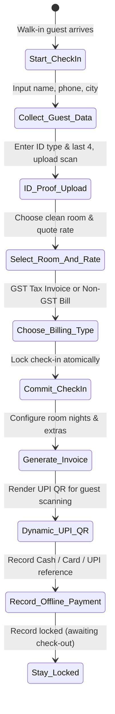
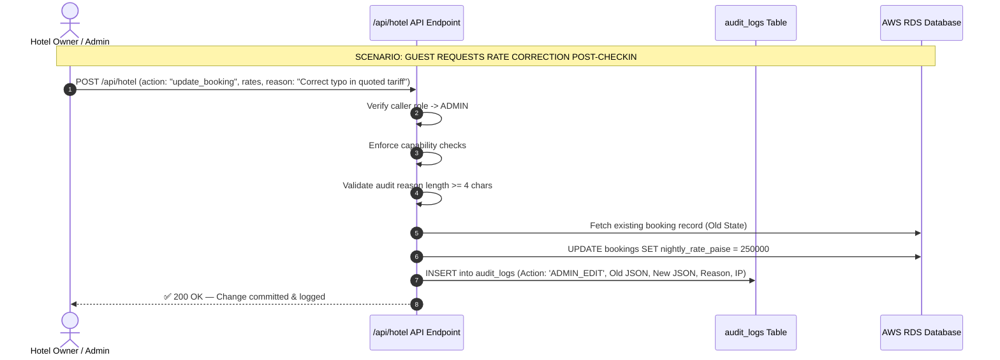
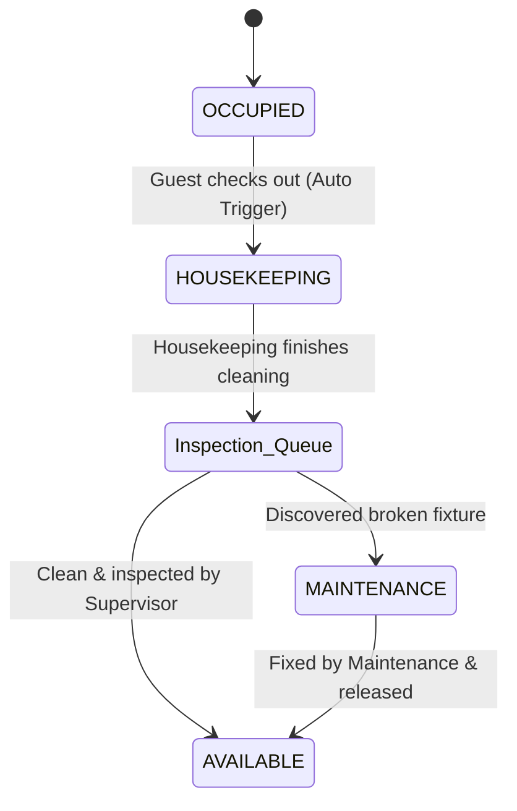

# HotelOS Management SaaS — Admin & Manager Workflows Specification

> **Document Classification**: Core Technical & Operational Workflows  
> **Target Audience**: Front-Desk Operators, Hotel Managers, Owners, and DevOps Engineers  
> **Status**: Production Release  
> **Version**: 2.0.0  

---

## 👥 1. Executive Summary: The Zero-Trust Operational Paradigm

HotelOS operates under a **Zero-Trust Front-Desk Model**. In hospitality environments, internal revenue leakage (cash theft, unrecorded walk-ins, and unauthorized manual tariff modifications) is a major risk. To combat this, the system enforces a strict capability boundary between **Hotel Admins (Owners / General Managers)** and **Hotel Managers (Front-Desk Operators / Cashiers)**.

```
                  ┌──────────────────────────────────────────────┐
                  │          GUEST ARRIVES AT COUNTER            │
                  └──────────────────────┬───────────────────────┘
                                         │
                                         ▼
                  ┌──────────────────────────────────────────────┐
                  │    FRONT-DESK MANAGER (CASHIER)              │
                  │  • Collects Name, Phone, City, Nationality  │
                  │  • Registers ID Proof (Last 4 + Upload)      │
                  │  • Confirms Check-In & Rate                 │
                  └──────────────────────┬───────────────────────┘
                                         │
                                         ▼
                  ┌──────────────────────────────────────────────┐
                  │         STAY CONFIRMED & LOCKED              │
                  │  • Record immediately locked from Manager    │
                  │  • Room transitions to OCCUPIED              │
                  └──────────────────────┬───────────────────────┘
                                         │
                     ┌───────────────────┴───────────────────┐
                     ▼                                       ▼
        ┌──────────────────────────┐            ┌──────────────────────────┐
        │   MANAGER LIMITATIONS    │            │     ADMIN CAPABILITIES   │
        │ • ❌ Cannot alter rates   │            │ • ✅ Can override stays  │
        │ • ❌ Cannot cancel stays  │            │ • ✅ Can issue refunds   │
        │ • ❌ Cannot edit billing  │            │ • ✅ Audit-logged reason │
        └──────────────────────────┘            └──────────────────────────┘
```

---

## 2. 📋 Deep-Dive: Front-Desk Manager Workflow (Daily Check-In & Billing)

The **Hotel Manager** role is optimized for speed, reliability, and cash collection at the counter.



### Step 1: Walk-In Registration
The receptionist opens the **Front Desk** module and clicks **`Start Check-In`**. To guarantee lightning-fast registration, unnecessary address details are omitted.
* **Fields Input**:
  1. **Full Name** (Required, e.g., `Priya Sharma`)
  2. **Mobile Number** (Required, e.g., `+91 98765 43210`)
  3. **Email** (Optional)
  4. **City** (Optional, e.g., `Pune`)
  5. **Nationality** (Required, defaults to `Indian`)
  6. **Country** (Hidden field, default: `India`)

### Step 2: ID Verification & Scan Upload
Under police compliance rules (Form-C registration for hotels), identity proofs must be recorded.
* **ID Type Selection**: Aadhaar, Passport, Driving License, Voter ID, or Other.
* **ID Masking Constraint**: The manager only inputs the **final 4 digits** of the ID number (e.g., Aadhaar card's final 4 digits: `5678`).
* **Document Archival**: The physical ID is scanned/photographed via counter camera and uploaded directly. The file is encrypted and saved in a private storage bucket.

### Step 3: Room Selection & Tariff Quote
* **Room Selection**: The manager selects from a dynamic list of currently `AVAILABLE` (cleaned) rooms. Rooms marked as `HOUSEKEEPING` or `MAINTENANCE` are blocked from selection.
* **Tariff Calculation**: The counter rate can be quoted statically or calculated using the occupancy-based dynamic rate card.
* **Stay Duration**: Expected check-out date/time is entered.

### Step 4: Billing Type Routing
The guest is asked if they require a corporate tax credit:
1. **GST Tax Invoice**: Requires B2B fields:
   * **Company Name** (e.g., `Acme Technologies Private Limited`)
   * **Company GSTIN** (Validated against regex structure, e.g., `27AAACA1234A1Z1`)
   * **Place of Supply / Guest State** (Used for CGST/SGST vs. IGST tax routing)
2. **Non-GST Bill**: Clean consumer bill (zero tax fields generated).

### Step 5: Lock & Invoice Generation Flow
On clicking **Confirm**, the API handler executes an atomic database transaction:
1. Pushes the room status from `AVAILABLE` to `OCCUPIED`.
2. Inserts the booking record with `locked_at = now()`.
3. Creates a pending invoice sequence.
4. Auto-redirects the manager to the **Invoice Configuration Screen** to add extras (e.g., room service meals, laundry, cab transfers).

### Step 6: Counter Payment Collection
* **Dynamic UPI QR Code**: The system displays a high-resolution NPCI QR code containing the exact bill amount (e.g., `₹5,600.00`) and the invoice reference.
* **Guest Scan**: The guest scans the screen via their UPI app (Google Pay, PhonePe, Paytm, BHIM) and pays instantly.
* **Offline Recording**: Once payment is verified on the bank terminal, the manager records:
  * **Payment Method**: `CASH`, `CARD_TERMINAL`, `UPI_MANUAL`, or `BANK_TRANSFER`.
  * **Reference Number**: The bank/UPI transaction ID (e.g., `UPI/2026/98412`).
  * **Amount Recorded**: Normalizes value to integer paise (e.g., `560000` paise).

---

## 👔 3. Deep-Dive: Hotel Admin / Owner Workflow

The **Hotel Admin (Owner / GM)** holds master capabilities to manage configurations, oversee staff, resolve discrepancies, and override locked records.



### Operational Workflows:

#### Workflow A: Staff Account & Access Control
Admins manage the physical front-desk terminals and cashiers:
1. **Onboard Staff**: Create new logins with email, password, and assign roles (`MANAGER`, `HOUSEKEEPING`, `ACCOUNTANT`).
2. **Revoke Access**: Instantly disable a terminated employee. The database update immediately invalidates all active JWT tokens for that user within 3 seconds, blocking further mutations.

#### Workflow B: Audited Stay Modifications & Room Changes
If a receptionist makes an error in typing the name, rate, or party size, the manager is blocked from correcting it. The Owner/Admin must execute the correction:
1. The Admin opens the guest's folio and clicks **`Manage Stay`**.
2. Modifies the required parameters (e.g., room change from `101` to `104`).
3. Enters a **compulsory override reason** (e.g., `"Guest shifted to deluxe room due to AC leak"`).
4. Saves. The system writes:
   * **Old values** and **new values** as JSON snapshots.
   * **Admin User ID**, **actor IP address**, and **override reason** into `audit_logs`.

#### Workflow C: Voiding & Canceling Bills
Once an invoice/bill is generated, it cannot be deleted. If a reservation is canceled or disputed:
1. The Admin selects **`Void Invoice`** or **`Cancel Stay`**.
2. Records a mandatory audit trail reason.
3. The invoice status transitions to `VOID` or `CANCELLED`.
4. Any recorded payment remains in the ledger as a credit, requiring an admin-authorized cash payout or voucher registration.

---

## 🧹 4. Housekeeping & Maintenance Cycle

The **Housekeeping** role keeps the physical property in sync with the booking engine.



### Operational Steps:
1. **Checkout Trigger**: When a guest check-out is finalized, the room status automatically changes to `HOUSEKEEPING`.
2. **Task View**: Housekeeping staff log into their mobile/tablet dashboard and see a live list of dirty rooms.
3. **Cleaning Update**: Once the room is scrubbed and clean sheets are laid, the staff click **`Mark Clean`**.
4. **Admin Release**: The supervisor inspects the room and clicks **`Set Available`**, which immediately updates the front desk's check-in room list.

---

## 💵 5. Shift Handover & Cash Drawer balancing

To prevent cash discrepancies and staff shift errors, cash drawers must be reconciled during shift transitions.

### Step-by-Step Handover Protocol:
1. **Departure**: The departing manager logs in and clicks **`Shift Handover`**.
2. **Denomination Audit**: The manager enters the count of all physical currency notes in the register drawer:
   * $N_{2000} \times ₹2,000$
   * $N_{500} \times ₹500$
   * $N_{200} \times ₹200$
   * $N_{100} \times ₹100$
   * $N_{50} \times ₹50$
   * $N_{10} \times ₹10$ + Coins
3. **Automated Calculation**: The system computes the expected cash balance:
   $$\text{Expected Cash} = \text{Opening Float} + \sum \text{Counter Cash Payments} - \sum \text{Counter Cash Paid-Outs}$$
4. **Variance Check**:
   $$\text{Variance} = \text{Counted Cash} - \text{Expected Cash}$$
   * If **`Variance === 0`**, the shift closes cleanly.
   * If **`Variance !== 0`**, the cashier must input a **mandatory justification note** explaining the difference.
5. **Ownership Transfer**: The incoming manager verifies the drawer cash, signs off on the handover, and the dashboard resets the counter cash ledger. A PDF copy of the handover report is sent directly to the Hotel Owner.

---

## 📊 6. Role Capability Permission Matrix

The system enforces strict RBAC (Role-Based Access Control) on the server. Below is the detailed capability matrix:

| Action / Capability | Role Permission Required | Audit Logged? | Locked Record Restriction |
| :--- | :--- | :---: | :--- |
| **Start Walk-In Check-In** | `ADMIN` / `MANAGER` | No | N/A (New Record) |
| **Confirm Walk-In Check-In** | `ADMIN` / `MANAGER` | **Yes** | Auto-Locks on Save |
| **Upload ID Document Scan** | `ADMIN` / `MANAGER` | No | Allowed only during check-in |
| **View Decrypted ID Document** | `ADMIN` | **Yes** | Restricted from managers |
| **Change Quoted Nightly Rate** | `ADMIN` | **Yes** | Blocked for Managers |
| **Switch Occupied Room (Move Stay)**| `ADMIN` | **Yes** | Blocked for Managers |
| **Shorten / Extend Stay** | `ADMIN` | **Yes** | Blocked for Managers |
| **Generate GST Invoice / Bill** | `ADMIN` / `ACCOUNTANT` | **Yes** | Blocked for Managers |
| **Record Cash / Card Payment** | `ADMIN` / `MANAGER` / `ACCOUNTANT` | **Yes** | Allowed on active stays |
| **Void / Cancel Bill** | `ADMIN` / `ACCOUNTANT` | **Yes** | Blocked for Managers |
| **Finalize Guest Check-Out** | `ADMIN` / `MANAGER` | **Yes** | Allowed when balance is zero |
| **Reset Room: Dirty $\rightarrow$ Available** | `ADMIN` / `HOUSEKEEPING` | No | Housekeeping Board |
| **Disable Staff Account** | `ADMIN` | **Yes** | Multi-Tenant Isolated |
| **Export GST Financial Ledger** | `ADMIN` / `ACCOUNTANT` | No | Tenant Isolated |

---

## 🖨️ 7. Print & Document Templates

All invoices and receipts are formatted for two target print devices:
1. **Full-Page Laser Print (A4)**: Used for corporate GST tax invoices.
2. **Thermal Receipt Print (80mm)**: Used for cash receipts and guest checkout folios.

### Template Standard Elements:
* **Tax Invoices** strictly contain Trade Name, registered address, GSTIN, HSN Code `996311`, Taxable values, CGST & SGST percentage rates, and signatures.
* **Guest Folios** present a simplified list of room charges, order dining charges, tax-free services, and the payments recorded, showing a clean zero-balance clearance.
