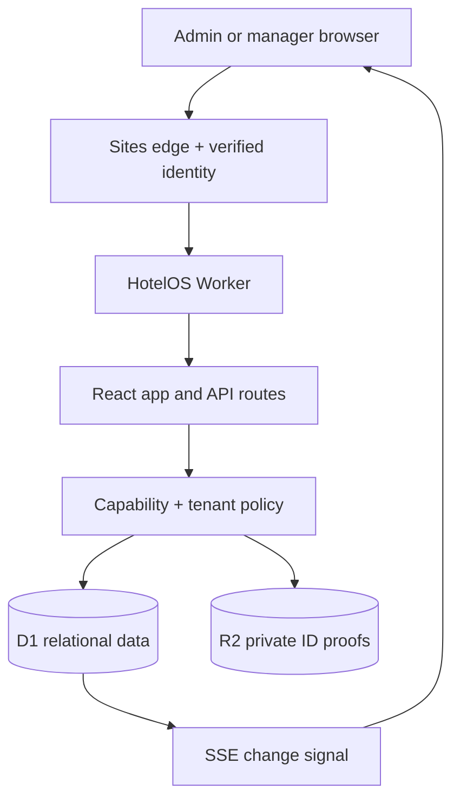
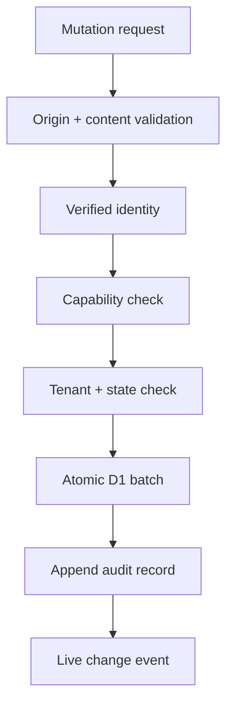
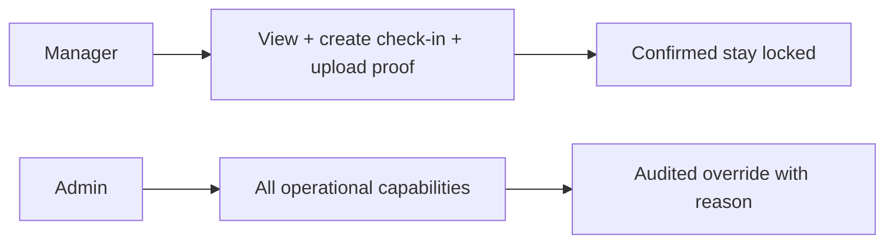
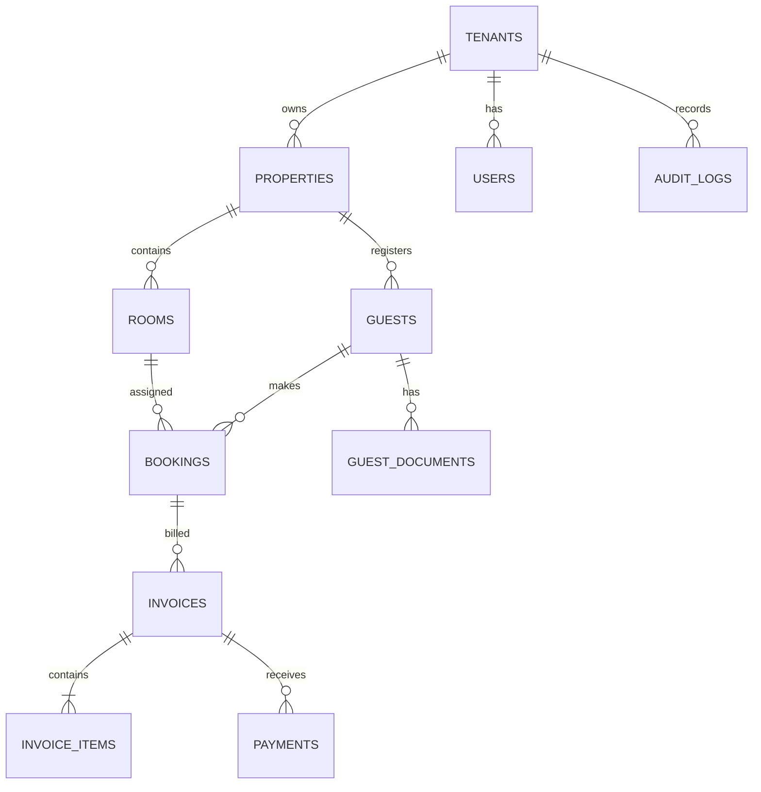

# System architecture

## Runtime topology

The Worker sets the runtime bindings before Vinext dispatches a page or API route. Browser identity comes from platform-owned authentication headers. The application looks up the email in `users`, then attaches the tenant, property, and role to the request-side session.

## Write flow

Manager check-in inserts the guest and booking, marks the room occupied, and appends the audit entry in one D1 batch. A partial unique index on active bookings prevents two concurrent requests from occupying the same room.

## Access enforcement

The browser receives only the sections appropriate to the current role. The API independently invokes `requireCapability()` before each mutation. Manager requests for admin actions return HTTP 403 even if a client attempts to construct the request manually.

## Data model

### Important fields

| Entity | Purpose and key constraints |
|---|---|
| `tenants` | Top-level SaaS isolation boundary. |
| `properties` | Hotel identity, state, GSTIN, currency, and default GST basis points. |
| `users` | Verified email, role, active flag, tenant/property membership, creator, and last-seen time. |
| `rooms` | Composite unique property/room number, type, integer paise rate, and controlled status. |
| `guests` | Contact profile, address, nationality, ID type, and only the last four ID digits. |
| `guest_documents` | R2 object key and non-sensitive metadata; bytes never enter D1. |
| `bookings` | Room, guest, dates, party size, billing choice, money, lock time, and lifecycle status. |
| `invoices` | Type, GST basis points, CGST/SGST/IGST, total, balance, and status in integer paise. |
| `payments` | Manual method, reference, amount, receiver, and timestamp; no gateway token. |
| `audit_logs` | Append-only actor/action/reason/old/new/IP/timestamp history. |

## Scale-out path

The current architecture is suitable for an operational MVP and moderate property load. At larger scale:

1. Partition tenants across D1 databases or move analytical replicas to PostgreSQL/BigQuery.
2. Replace database-polling SSE with Durable Objects or managed pub/sub fan-out.
3. Send audit and finance events to an immutable warehouse for long retention.
4. Add PMS/channel-manager ingestion through idempotent connector workers and queues.
5. Add warehouse-backed portfolio analytics without putting dashboard scans on the transactional database.
