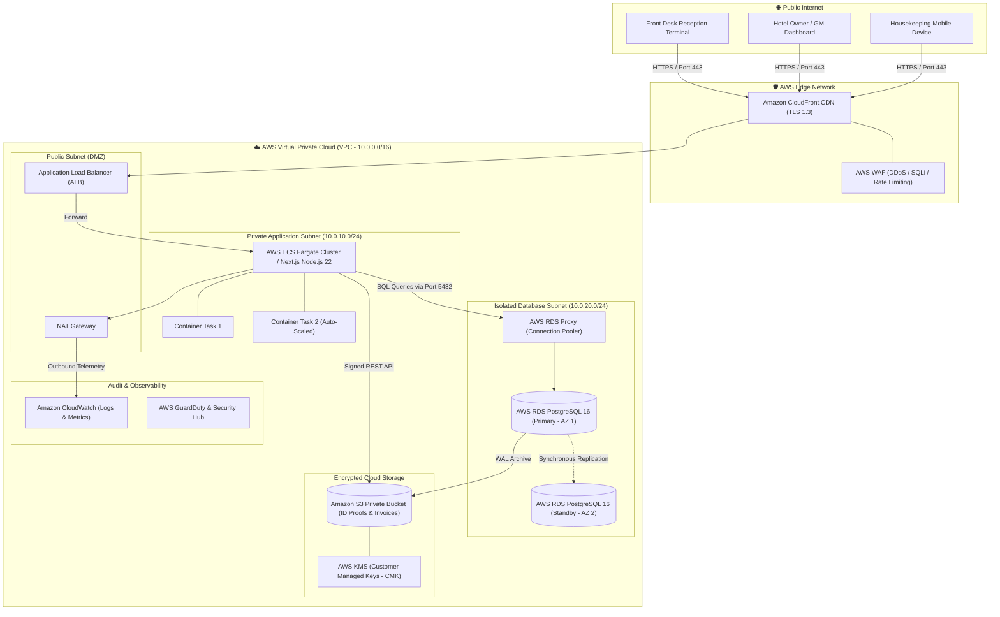
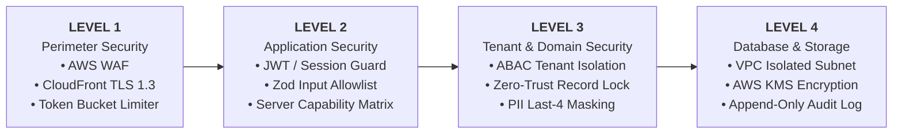
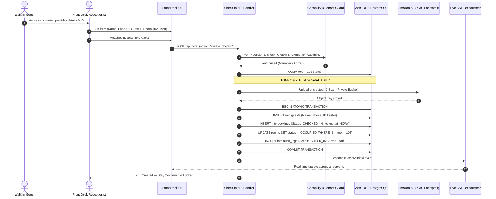
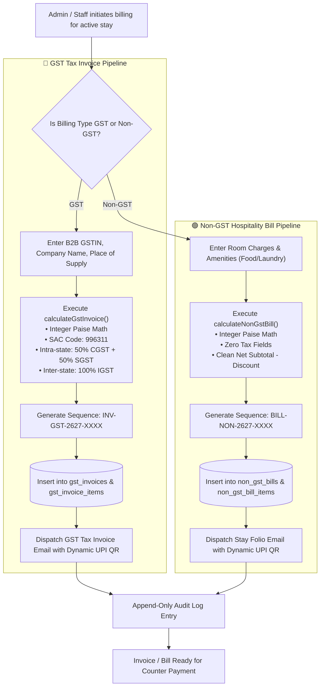
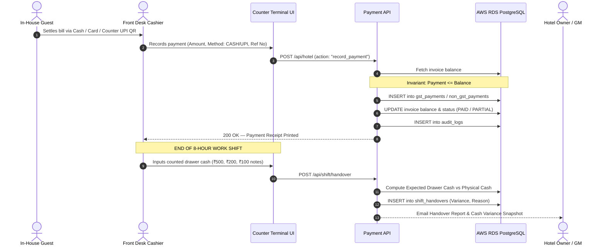
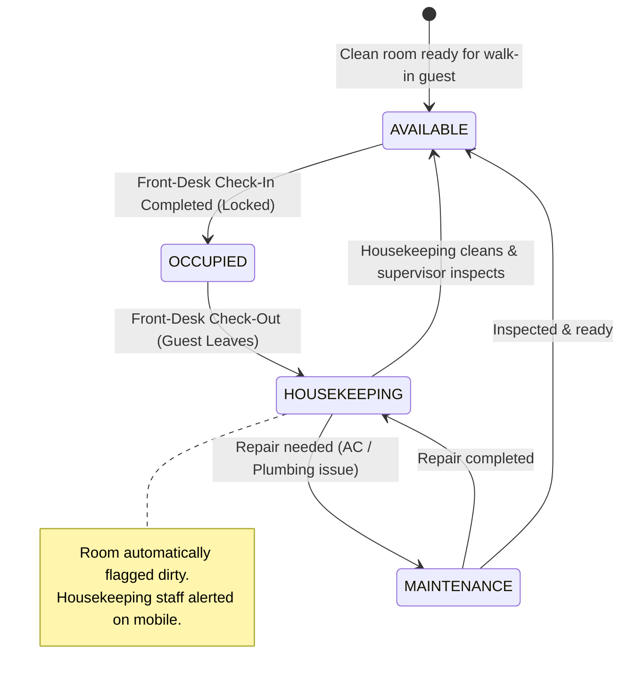
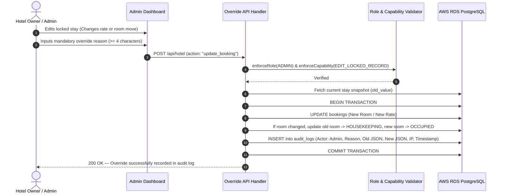
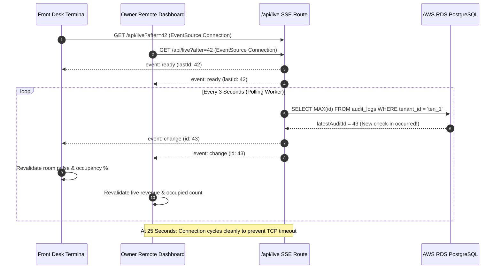
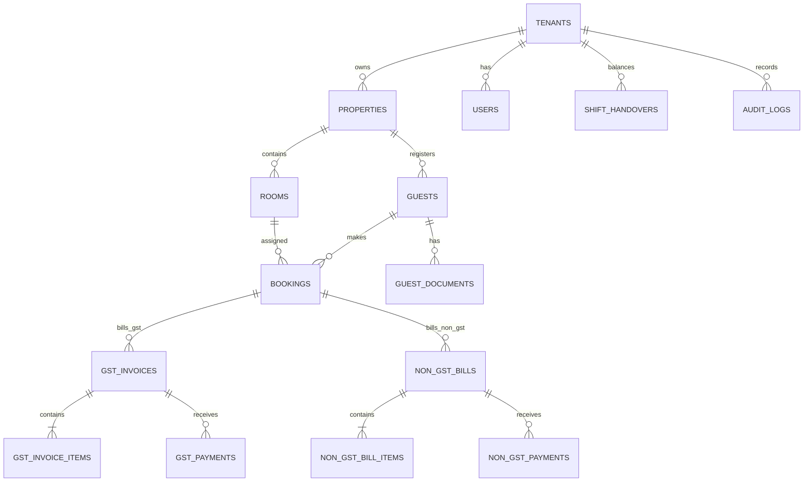

# HotelOS Management SaaS — System Architecture & Data Flow Specification

> **Document Type**: Enterprise System Architecture, AWS Infrastructure & Security Data Flow  
> **Status**: Production-Ready Blueprint  
> **Version**: 2.0.0  

---

## Table of Contents
1. [AWS Cloud Infrastructure & Network Topology](#1-aws-cloud-infrastructure--network-topology)
2. [Multi-Tier Security Architecture (Levels 1 to 4)](#2-multi-tier-security-architecture-levels-1-to-4)
   - [Level 1: Perimeter & Network Security](#level-1-perimeter--network-security)
   - [Level 2: Application & Identity Security](#level-2-application--identity-security)
   - [Level 3: Multi-Tenant & Anti-Fraud Boundary](#level-3-multi-tenant--anti-fraud-boundary)
   - [Level 4: Database & Storage Encryption (AWS RDS & S3)](#level-4-database--storage-encryption-aws-rds--s3)
3. [End-to-End Operational Data Flows](#3-end-to-end-operational-data-flows)
   - [Flow 1: Front-Desk Walk-In Check-In & Room Assignment](#flow-1-front-desk-walk-in-check-in--room-assignment)
   - [Flow 2: Billing & Invoice Generation (GST vs. Non-GST Decoupled Routing)](#flow-2-billing--invoice-generation-gst-vs-non-gst-decoupled-routing)
   - [Flow 3: Offline Payment Settlement & Shift Handover](#flow-3-offline-payment-settlement--shift-handover)
   - [Flow 4: Guest Check-Out & Housekeeping Lifecycle](#flow-4-guest-check-out--housekeeping-lifecycle)
   - [Flow 5: Admin Override & Immutable Audit Logging](#flow-5-admin-override--immutable-audit-logging)
   - [Flow 6: Real-Time SSE Operational Pulse Broadcaster](#flow-6-real-time-sse-operational-pulse-broadcaster)
4. [Relational Database Schema (AWS RDS PostgreSQL)](#4-relational-database-schema-aws-rds-postgresql)
5. [Disaster Recovery & High Availability SLAs](#5-disaster-recovery--high-availability-slas)

---

## 1. AWS Cloud Infrastructure & Network Topology



---

## 2. Multi-Tier Security Architecture (Levels 1 to 4)



---

### Level 1: Perimeter & Network Security
* **AWS CloudFront + AWS WAF**: Blocks malicious SQL injection, cross-site scripting (XSS), and automated bots before reaching backend containers.
* **TLS 1.3 In-Transit Encryption**: All communication enforces HTTPS with strict HSTS (`max-age=63072000; includeSubDomains; preload`).
* **Token Bucket Rate Limiting**: Max 30 mutations/min per staff account; 5 login attempts/min before a 15-minute IP lockout.
* **Strict HTTP Headers**: `X-Frame-Options: DENY`, `X-Content-Type-Options: nosniff`, `Content-Security-Policy`, and restricted device permissions (`camera=(), microphone=(), payment=()`).

---

### Level 2: Application & Identity Security
* **Session Identity Resolution**: Verified platform identity headers cross-referenced with active `users` records.
* **Server-Side Capability Verification**: Every mutation route executes `enforceCapability()` before processing. Frontend button hiding is **never** treated as authorization.
* **Zod Runtime Type Safety**: Rejects unexpected or malicious JSON keys via strict allowlisting and bounds checking.
* **CSRF Origin Verification**: Mutation routes reject mismatched `Origin` or non-JSON payloads (`Content-Type: application/json`).

---

### Level 3: Multi-Tenant & Anti-Fraud Boundary
* **Attribute-Based Access Control (ABAC)**: All SQL queries automatically enforce `WHERE tenant_id = session.tenantId AND property_id = session.propertyId`.
* **Zero-Trust Record Locking**: Receptionist check-in triggers immediate `locked_at = nowIso()`. Receptionists have **zero edit/delete capability**.
* **PII Minimization (DPDP Act Compliance)**: Government IDs store only the last 4 digits (e.g. `•••• 1234`) in searchable tables. Full scans remain in encrypted S3 buckets.

---

### Level 4: Database & Storage Encryption (AWS RDS & S3)
* **Isolated Private Subnets**: AWS RDS PostgreSQL has **no public IP address** and is accessible only from the application container security group on port 5432.
* **AWS KMS Envelope Encryption**: Database storage, automated snapshots, and S3 objects are encrypted at rest using AES-256 with AWS Key Management Service (KMS).
* **Temporary S3 Pre-Signed URLs**: ID proofs are never made public. Admins receive short-lived (5-minute TTL) signed URLs for verification.
* **Append-Only Immutable Audit Trail**: All overrides, rate changes, and billing mutations record an unchangeable JSON before/after diff with client IP and reason.

---

## 3. End-to-End Operational Data Flows

---

### Flow 1: Front-Desk Walk-In Check-In & Room Assignment



---

### Flow 2: Billing & Invoice Generation (GST vs. Non-GST Decoupled Routing)



---

### Flow 3: Offline Payment Settlement & Shift Handover



---

### Flow 4: Guest Check-Out & Housekeeping Lifecycle



---

### Flow 5: Admin Override & Immutable Audit Logging



---

### Flow 6: Real-Time SSE Operational Pulse Broadcaster



---

## 4. Relational Database Schema (AWS RDS PostgreSQL)



### Table Summary:
| Table Name | Primary Purpose | Key Constraints |
| :--- | :--- | :--- |
| `tenants` | Top-level multi-tenant SaaS isolation boundary. | `id PRIMARY KEY` |
| `properties` | Hotel entity, state, GSTIN, and default tax parameters. | `tenant_id REFERENCES tenants(id)` |
| `users` | Staff & admin accounts with role and active status. | `UNIQUE(email)` |
| `rooms` | Physical room inventory, floor, rate in paise, status. | `UNIQUE(property_id, room_number)` |
| `guests` | Contact details, nationality, masked last-4 ID. | `INDEX(tenant_id, phone)` |
| `guest_documents`| Metadata for private S3 ID uploads (bytes never in DB). | `guest_id REFERENCES guests(id)` |
| `bookings` | Stay lifecycle, dates, adults, locked timestamp. | `UNIQUE INDEX ON (room_id) WHERE status = 'CHECKED_IN'` |
| `gst_invoices` | Official GST Tax Invoices with SAC 996311 & tax splits. | `UNIQUE(invoice_number)` (INV-GST-XXXX) |
| `gst_invoice_items`| Itemized tax rows per invoice. | `invoice_id REFERENCES gst_invoices(id)` |
| `gst_payments` | Offline payment entries against GST invoices. | `invoice_id REFERENCES gst_invoices(id)` |
| `non_gst_bills` | Plain hospitality bills without tax fields. | `UNIQUE(bill_number)` (BILL-NON-XXXX) |
| `non_gst_bill_items`| Plain itemized stay & food charges. | `bill_id REFERENCES non_gst_bills(id)` |
| `non_gst_payments`| Offline payment entries against Non-GST bills. | `bill_id REFERENCES non_gst_bills(id)` |
| `shift_handovers`| Front-desk cash drawer balance and shift handovers. | `INDEX(tenant_id, created_at)` |
| `audit_logs` | Append-only immutable log of every system mutation. | `INDEX(tenant_id, id)` (Partitioned Monthly) |

---

## 5. Disaster Recovery & High Availability SLAs

```
┌─────────────────────────────────────────────────────────────┬─────────────────────────────────────────────────────────────┐
│ METRIC / SLA                                                │ AWS CONFIGURATION & TARGET                                  │
├─────────────────────────────────────────────────────────────┼─────────────────────────────────────────────────────────────┤
│ 1. Uptime Availability SLA                                  │ 99.95% (Multi-AZ RDS + ECS Fargate Auto-Scaled)             │
│ 2. Recovery Point Objective (RPO)                           │ <= 5 Minutes (Continuous WAL Archival to Amazon S3)         │
│ 3. Recovery Time Objective (RTO)                             │ <= 15 Minutes (Automated Multi-AZ Failover < 60 Seconds)    │
│ 4. Point-in-Time Recovery (PITR) Window                     │ Restore database state to any exact second in last 35 days  │
│ 5. Automated Cross-Region DR Backup                         │ Daily snapshot copied from ap-south-1 (Mumbai) to Singapore│
│ 6. Data Encryption Standard                                 │ AES-256 via AWS KMS (Customer Managed Key CMK)             │
└─────────────────────────────────────────────────────────────┴─────────────────────────────────────────────────────────────┘
```
