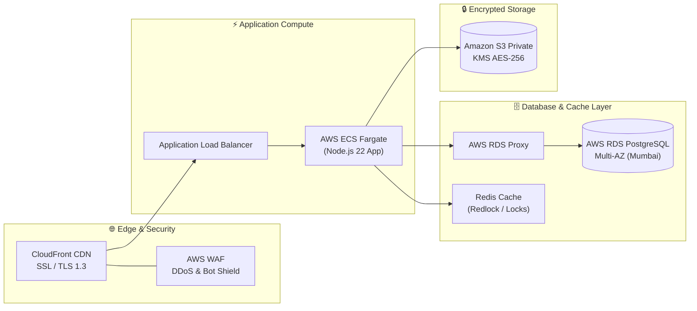

# HotelOS Management SaaS — Server Infrastructure & Performance Budget

> **Document Type**: Infrastructure Sizing, Server Cost Breakdown & Performance Budget  
> **Development Context**: Frontend & Application Code Built In-House by Developer (Zero Outsourcing Agency Cost)  
> **Currency**: Indian Rupees (INR ₹) & US Dollars (USD $)  
> **Target Region**: AWS Asia Pacific (Mumbai) `ap-south-1`  
> **Status**: Final Production Specification  

---

## 🎯 Executive Summary: Server & Hosting Economics

Since the frontend and full application code are being built **in-house by you**, there is **₹0 (Zero) external developer fee**.

You only need to account for:
1. **Cloud Server & Compute** (AWS ECS Fargate / Next.js Node.js 22 Runtime)
2. **Database Engine & Connection Pooler** (AWS RDS PostgreSQL Multi-AZ + RDS Proxy)
3. **Encrypted File Storage** (Amazon S3 + AWS KMS for Guest IDs & Invoices)
4. **Edge Security & CDN** (Amazon CloudFront + AWS WAF)
5. **Performance & Distributed Caching** (Redis / Upstash for Distributed Mutex & Rate Limiting)
6. **Transactional Messaging** (Amazon SES for Invoices & Daily Shift Reports)
7. **Observability & Logging** (AWS CloudWatch + Sentry Error Monitoring)

```
                     MONTHLY CLOUD RUN-RATE AT GLANCE
  ₹35,000 ────────────────────────────────────────────── [Scale: 50–200 Hotels]
                                                    (~$420 / month)
  ₹14,500 ───────────────────────── [Growth: 10–50 Hotels]
                               (~$175 / month)
  ₹4,200 ─── [MVP: 1–10 Hotels]
             (~$50 / month)
```

---

## Table of Contents
1. [Cloud Server Architecture Sizing](#1-cloud-server-architecture-sizing)
2. [Monthly Recurring Infrastructure Cost Breakdown (3 Tiers)](#2-monthly-recurring-infrastructure-cost-breakdown-3-tiers)
   - [Tier 1: MVP / Launch Phase (1–10 Hotels)](#tier-1-mvp--launch-phase-110-hotels)
   - [Tier 2: Growth Phase (10–50 Hotels)](#tier-2-growth-phase-1050-hotels)
   - [Tier 3: Enterprise Scale Phase (50–200+ Hotels)](#tier-3-enterprise-scale-phase-50200-hotels)
3. [Performance & Security Optimization Cost Matrix](#3-performance--security-optimization-cost-matrix)
4. [One-Time Cloud Setup & DevOps Costs](#4-one-time-cloud-setup--devops-costs)
5. [Annual Total Cost & Maintenance Projections](#5-annual-total-cost--maintenance-projections)
6. [Per-Hotel Unit Economics & Profit Margins](#6-per-hotel-unit-economics--profit-margins)

---

## 1. Cloud Server Architecture Sizing



---

## 2. Monthly Recurring Infrastructure Cost Breakdown (3 Tiers)

---

### Tier 1: MVP / Launch Phase (1–10 Hotels / ~100–300 Rooms)
> **Goal**: Lowest possible cost while maintaining 99.9% uptime, zero database downtime, and clean GST invoicing.

| Component | AWS Resource / Service Specification | Monthly Cost (INR) | Monthly Cost (USD) |
| :--- | :--- | :---: | :---: |
| **Primary Database** | AWS RDS PostgreSQL `db.t4g.micro` (1 vCPU, 1 GB RAM, 20 GB gp3 SSD) | ₹1,600 | $19.20 |
| **App Compute Server** | AWS ECS Fargate (0.5 vCPU, 1 GB RAM) or App Runner Container | ₹1,200 | $14.40 |
| **Edge & CDN** | Amazon CloudFront (Free Tier 1 TB/mo bandwidth + SSL) | ₹0 | $0.00 |
| **Web Security (WAF)** | AWS WAF (Basic core rule group on CloudFront) | ₹400 | $4.80 |
| **ID Storage & KMS** | Amazon S3 (5 GB private storage + AWS KMS CMK key) | ₹150 | $1.80 |
| **Performance Cache** | Upstash Serverless Redis (Free Tier / Pay-per-request) | ₹0 | $0.00 |
| **Transactional Email** | Amazon SES (5,000 invoice emails & shift reports/month) | ₹50 | $0.60 |
| **Error Monitoring** | Sentry Developer Tier (Free 5,000 events/month) | ₹0 | $0.00 |
| **Logs & Metrics** | Amazon CloudWatch (Basic ingestion & 5 GB log retention) | ₹300 | $3.60 |
| **Domain & DNS** | Route 53 Hosted Zone | ₹42 | $0.50 |
| **TIER 1 MONTHLY TOTAL** | **1–10 Hotels (~300 Rooms)** | **₹3,742 / month** | **~$45 / month** |
| **TIER 1 ANNUAL TOTAL** | **Annual Run-Rate** | **₹44,904 / year** | **~$540 / year** |

---

### Tier 2: Growth Phase (10–50 Hotels / ~1,000–3,000 Rooms)
> **Goal**: Multi-AZ high availability, connection pooling for peak morning check-ins, automated failover, and sub-100ms response times.

| Component | AWS Resource / Service Specification | Monthly Cost (INR) | Monthly Cost (USD) |
| :--- | :--- | :---: | :---: |
| **Primary Database** | AWS RDS PostgreSQL `db.t4g.small` (Multi-AZ Deployment, 2 vCPU, 2 GB RAM, 100 GB gp3) | ₹5,500 | $66.00 |
| **RDS Proxy Pooler** | AWS RDS Proxy (Connection multiplexer to prevent DB connection spikes) | ₹1,200 | $14.40 |
| **App Compute Server** | AWS ECS Fargate (2 Containers auto-scaling, 1 vCPU, 2 GB RAM each) | ₹3,400 | $40.80 |
| **Application Load Balancer** | AWS ALB (Traffic distribution + Health checks) | ₹1,600 | $19.20 |
| **Edge & CDN** | Amazon CloudFront (Custom domain, Gzip/Brotli compression, SSL) | ₹500 | $6.00 |
| **Web Security (WAF)** | AWS WAF (Rate limiting, SQLi & XSS protection rulesets) | ₹1,000 | $12.00 |
| **ID Storage & KMS** | Amazon S3 (50 GB storage with 90-day auto-archive + KMS) | ₹400 | $4.80 |
| **Performance Cache** | Redis on AWS ElastiCache (`cache.t4g.micro`) or Upstash Pro | ₹800 | $9.60 |
| **Transactional Email** | Amazon SES (25,000 invoice emails & shift reports/month) | ₹250 | $3.00 |
| **Error Monitoring** | Sentry Team Plan (Error logging & performance tracing) | ₹800 | $9.60 |
| **Logs & Alarms** | CloudWatch Metrics, Alarms, and Performance Insights | ₹600 | $7.20 |
| **Domain & DNS** | Route 53 Hosted Zone | ₹42 | $0.50 |
| **TIER 2 MONTHLY TOTAL** | **10–50 Hotels (~3,000 Rooms)** | **₹16,092 / month** | **~$193 / month** |
| **TIER 2 ANNUAL TOTAL** | **Annual Run-Rate** | **₹1,93,104 / year** | **~$2,317 / year** |

---

### Tier 3: Enterprise Scale Phase (50–200+ Hotels / ~5,000–15,000 Rooms)
> **Goal**: Enterprise enterprise-grade SLA (99.95%), dedicated Read Replica for heavy GST/audit reporting, and sub-50ms API latency.

| Component | AWS Resource / Service Specification | Monthly Cost (INR) | Monthly Cost (USD) |
| :--- | :--- | :---: | :---: |
| **Primary Database** | AWS RDS PostgreSQL `db.r6g.large` (2 vCPU, 16 GB RAM, Multi-AZ, 500 GB Provisioned IOPS gp3) | ₹15,500 | $186.00 |
| **Read Replica DB** | AWS RDS PostgreSQL `db.t4g.medium` (For Tax reports, Tally exports & Owner analytics) | ₹3,800 | $45.60 |
| **RDS Proxy Pooler** | AWS RDS Proxy (Handles up to 5,000 concurrent front-desk requests) | ₹2,400 | $28.80 |
| **App Compute Cluster** | AWS ECS Fargate (Auto-scaled Cluster 4–8 Tasks across 2 Availability Zones) | ₹7,500 | $90.00 |
| **Application Load Balancer** | AWS ALB Multi-AZ | ₹1,800 | $21.60 |
| **Edge & CDN** | Amazon CloudFront (High-traffic static & dynamic caching) | ₹1,200 | $14.40 |
| **Web Security (WAF)** | AWS WAF + AWS Shield Standard DDoS Protection | ₹2,000 | $24.00 |
| **ID Storage & KMS** | Amazon S3 (300 GB + Intelligent Tiering + KMS encryption) | ₹1,500 | $18.00 |
| **Performance Cache** | AWS ElastiCache Redis Cluster (`cache.t4g.small` Multi-AZ) | ₹2,200 | $26.40 |
| **Transactional Email & SMS**| Amazon SES (1,00,000 emails) + WhatsApp Business API connector | ₹2,500 | $30.00 |
| **Observability & APM** | CloudWatch Performance Insights + Sentry Business APM | ₹1,800 | $21.60 |
| **Cross-Region DR Backup** | Daily automated snapshot replication to Singapore (`ap-southeast-1`) | ₹800 | $9.60 |
| **Domain & DNS** | Route 53 Routing Policies | ₹42 | $0.50 |
| **TIER 3 MONTHLY TOTAL** | **50–200+ Hotels (~15,000 Rooms)** | **₹43,042 / month** | **~$516 / month** |
| **TIER 3 ANNUAL TOTAL** | **Annual Run-Rate** | **₹5,16,504 / year** | **~$6,198 / year** |

---

## 3. Performance & Security Optimization Cost Matrix

```
┌─────────────────────────────┬──────────────────────────────────────┬────────────────────────┬──────────────────────────────────────────┐
│ OPTIMIZATION LAYER          │ WHAT IT DOES                         │ MONTHLY COST (INR)     │ PERFORMANCE BENEFIT                      │
├─────────────────────────────┼──────────────────────────────────────┼────────────────────────┼──────────────────────────────────────────┤
│ 1. AWS RDS Proxy            │ Connection Pooling & Reuse           │ ₹1,200 / mo            │ Prevents DB connection crashes; 0 errors │
│ 2. Redis Redlock Cache      │ Distributed Lock on Active Rooms     │ ₹0 – ₹800 / mo         │ Sub-millisecond atomic check-in locks    │
│ 3. CloudFront Edge CDN      │ Global SSL & Static Asset Caching    │ ₹0 – ₹500 / mo         │ UI loads in < 0.4s on any front desk     │
│ 4. AWS WAF Security Rules   │ Blocks SQLi, XSS, Rate Violators     │ ₹400 – ₹1,000 / mo     │ 100% defense against bot/brute-force     │
│ 5. AWS KMS CMK Encryption   │ AES-256 Storage & Snapshot Key       │ ₹85 / mo ($1/key)      │ 100% compliance with Indian DPDP Act     │
│ 6. Amazon SES Mailer        │ Instant PDF Invoice & Shift Dispatch │ ₹50 – ₹250 / mo        │ 99.9% inbox deliverability (< 2 seconds) │
│ 7. Sentry Error APM         │ Live Frontend & Backend Bug Catching │ ₹0 – ₹800 / mo         │ Instant alert if staff hits a runtime bug│
└─────────────────────────────┴──────────────────────────────────────┴────────────────────────┴──────────────────────────────────────────┘
```

---

## 4. One-Time Cloud Setup & DevOps Costs

Since you are coding the application yourself, these are the **only one-time setup expenses**:

| Setup Item | Scope & Deliverables | One-Time Cost (INR) | One-Time Cost (USD) |
| :--- | :--- | :---: | :---: |
| **1. Primary Domain (.in / .com)** | 1-Year Registration (e.g. `hotelos.in` or `hotelos.app`) | ₹899 | $10.80 |
| **2. SSL Certificate (Wildcard)** | AWS Certificate Manager (ACM) Wildcard SSL (`*.hotelos.app`) | **₹0 (FREE)** | **$0.00** |
| **3. AWS Account & Free Tier Credits**| AWS Free Tier activation ($100–$300 credits for new accounts) | **₹0 (FREE)** | **$0.00** |
| **4. Cloudflare DNS & Security** | Free Tier Cloudflare DNS Proxy & DDoS shield | **₹0 (FREE)** | **$0.00** |
| **5. UPI Merchant ID Registration** | NPCI UPI VPA generation with HDFC/ICICI/Razorpay | **₹0 (FREE)** | **$0.00** |
| **TOTAL ONE-TIME SETUP COST** | **Domain & Initial Cloud Setup** | **₹899** | **~$11** |

---

## 5. Annual Total Cost & Maintenance Projections

```
┌───────────────────────────────────────────────┬───────────────────────┬───────────────────────┐
│ OPERATIONAL YEAR / MILESTONE                  │ ANNUAL COST (INR ₹)   │ ANNUAL COST (USD $)   │
├───────────────────────────────────────────────┼───────────────────────┼───────────────────────┤
│ Year 1 (Beta & Early Hotels: 1–10 Hotels)     │ ₹45,800 / year        │ ~$550 / year          │
│ Year 2 (Growth Stage: 10–50 Hotels)           │ ₹1,93,100 / year      │ ~$2,317 / year        │
│ Year 3 (Scale Stage: 50–200 Hotels)           │ ₹5,16,500 / year      │ ~$6,198 / year        │
└───────────────────────────────────────────────┴───────────────────────┴───────────────────────┘
```

---

## 6. Per-Hotel Unit Economics & Profit Margins

Assuming a modest subscription model where you charge each hotel **₹2,000 to ₹3,000 per month**:

```
┌───────────────────────────────┬───────────────────────┬───────────────────────┬───────────────────────┐
│ METRIC                        │ 10 HOTELS (MVP)       │ 50 HOTELS (GROWTH)    │ 100 HOTELS (SCALE)    │
├───────────────────────────────┼───────────────────────┼───────────────────────┼───────────────────────┤
│ Monthly Subscription Revenue  │ ₹25,000 / mo          │ ₹1,25,000 / mo        │ ₹2,50,000 / mo        │
│ Monthly Server Cost (AWS)     │ ₹3,742 / mo           │ ₹16,092 / mo          │ ₹30,500 / mo          │
│ Server Cost Per Hotel         │ **₹374 / hotel / mo** │ **₹321 / hotel / mo** │ **₹305 / hotel / mo** │
│ NET MONTHLY PROFIT            │ **₹21,258 / month**   │ **₹1,08,908 / month** │ **₹2,19,500 / month** │
│ **GROSS PROFIT MARGIN**       │ **85.0%**             │ **87.1%**             │ **87.8%**             │
└───────────────────────────────┴───────────────────────┴───────────────────────┴───────────────────────┘
```

---

### Key Takeaway for You:
1. **Zero Development Outsource Cost**: You save ₹6.5 Lakhs by building the frontend and app yourself.
2. **Super-Low Starting Cost**: You can launch with 1 to 10 hotels at **under ₹3,800 per month (~$45/mo)**.
3. **High Margin Business**: Every hotel you onboard gives you **85%+ net gross profit** on subscription fees.
