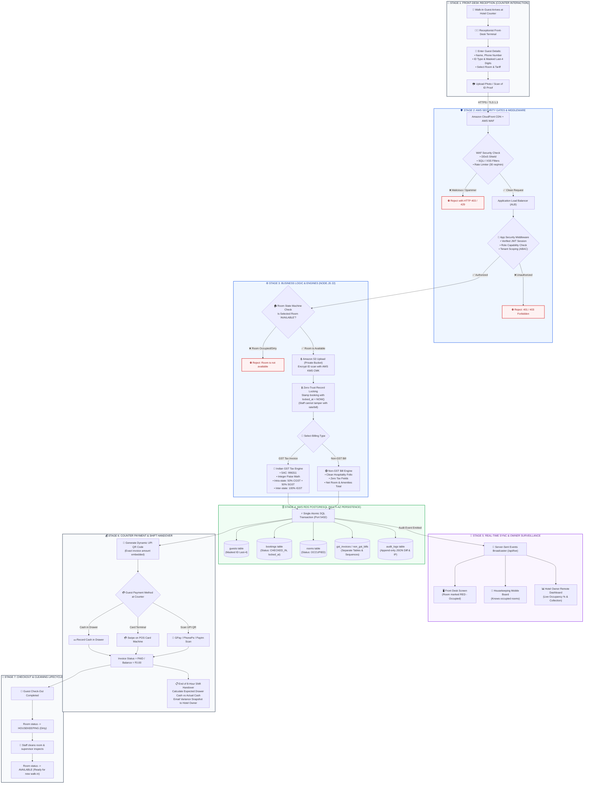

# HotelOS Management SaaS — Unified Master System Flowchart

> **Document Type**: Master Visual Flowchart & Architecture Blueprint  
> **Status**: Final Production Architecture  
> **Design Principle**: Complete End-to-End Visibility (From Physical Walk-In to Database & Owner Dashboard)  

---

## 🌟 The Complete Unified Master Flowchart



---

## 🔍 Stage-by-Stage Operational Summary

```
┌─────────────────┬──────────────────────────────────┬───────────────────────────────────────────────────────────┐
│ STAGE           │ CORE ACTION                      │ HOW IT WORKS & SECURITY INVOLVED                          │
├─────────────────┼──────────────────────────────────┼───────────────────────────────────────────────────────────┤
│ 1. Front Desk   │ Walk-In Registration             │ Guest arrives physically; receptionist inputs details,   │
│                 │                                  │ masks ID to last-4, and selects an available room.        │
├─────────────────┼──────────────────────────────────┼───────────────────────────────────────────────────────────┤
│ 2. Security     │ Perimeter & Identity Defense     │ AWS WAF blocks bots/attacks; JWT session enforces         │
│                 │                                  │ server-side RBAC permissions and tenant isolation.        │
├─────────────────┼──────────────────────────────────┼───────────────────────────────────────────────────────────┤
│ 3. App Logic    │ State Machine & Record Locking   │ Verifies room is AVAILABLE; locks record immediately so  │
│                 │                                  │ receptionist cannot alter rates; routes GST vs Non-GST.   │
├─────────────────┼──────────────────────────────────┼───────────────────────────────────────────────────────────┤
│ 4. Database     │ AWS RDS PostgreSQL Commit        │ Atomic SQL transaction writes guest, locked booking,      │
│                 │                                  │ room OCCUPIED, separated invoice, and immutable audit.    │
├─────────────────┼──────────────────────────────────┼───────────────────────────────────────────────────────────┤
│ 5. Real-Time    │ SSE Operational Live Pulse       │ Server-Sent Events instantly update front-desk screens,  │
│                 │                                  │ housekeeping mobile app, and Owner surveillance dashboard.│
├─────────────────┼──────────────────────────────────┼───────────────────────────────────────────────────────────┤
│ 6. Payment      │ Counter Settlement & Shift End   │ Dynamic UPI QR, Cash, or Card swipe settles bill; shift   │
│                 │                                  │ drawer cash reconciliation emailed to Owner.              │
├─────────────────┼──────────────────────────────────┼───────────────────────────────────────────────────────────┤
│ 7. Checkout     │ Housekeeping Recycling           │ Checkout automatically marks room HOUSEKEEPING (dirty);   │
│                 │                                  │ cleaning supervisor inspects and resets room to AVAILABLE.│
└─────────────────┴──────────────────────────────────┴───────────────────────────────────────────────────────────┘
```
